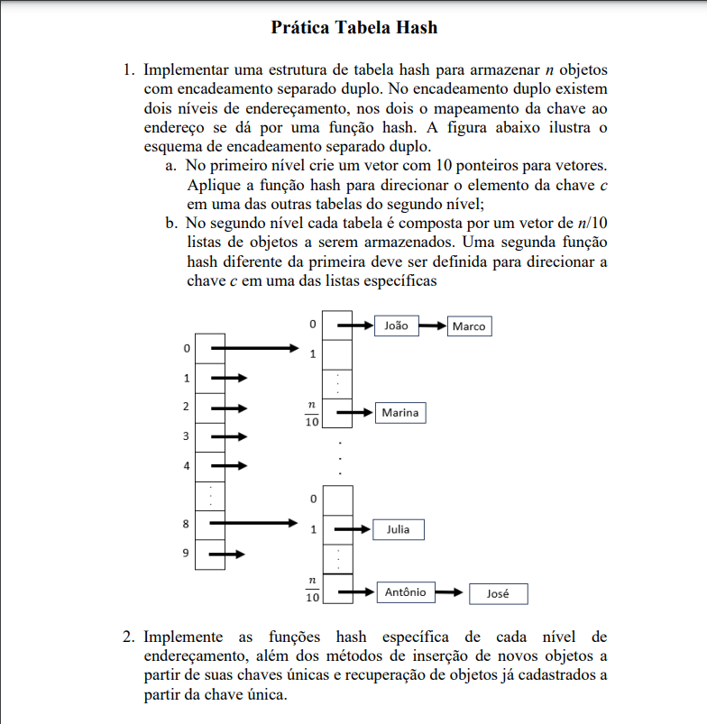

# Atividade de Tabela Hash - Estrutura de Dados

Nesta atividade, foram propostos dois desafios relacionados à implementação de tabelas hash. Aqui estão os códigos correspondentes para cada desafio.

### Código do Desafio 1

- **Classe:** `HashTableq1.java`
- **Funcionalidades Implementadas:**
  - Estrutura de tabela hash com encadeamento separado.
  - Funções hash específicas para o mapeamento de chaves em índices.
  - Métodos de inserção, verificação de presença e remoção de objetos na tabela.

### Código do Desafio 2

- **Classe:** `HashTableq2.java`
- **Funcionalidades Implementadas:**
  - Estrutura de tabela hash com encadeamento separado duplo.
  - Funções hash específicas para o mapeamento de chaves em índices em dois níveis.
  - Métodos de inserção e recuperação de objetos com base em chaves únicas.

